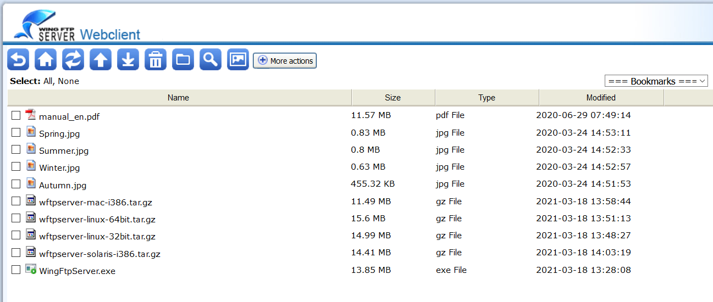
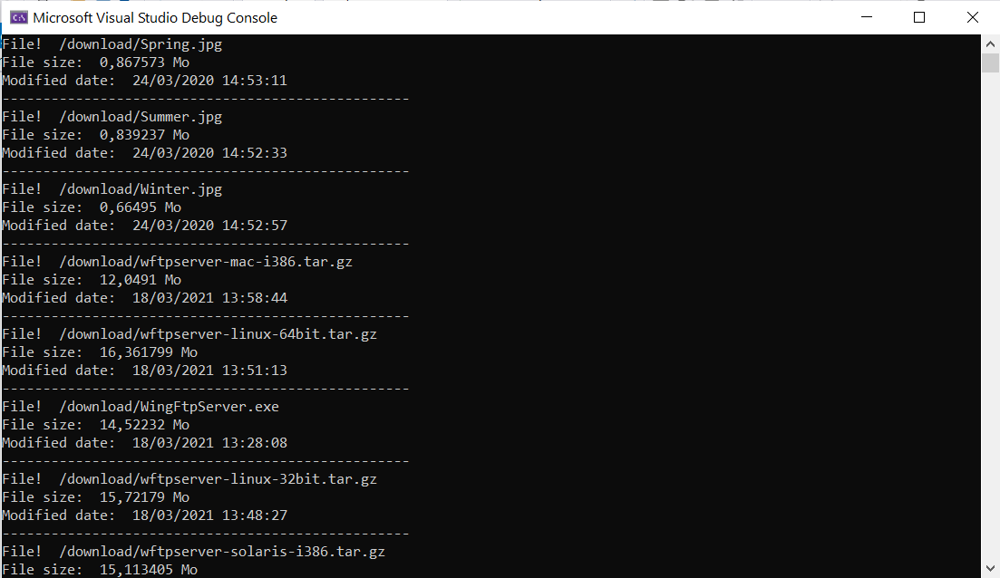

## Connect to  remote FTP Server

In this sample, i use the Wing FTP Server Online Demo.

[Click here for more details](https://www.wftpserver.com/onlinedemo.htm)

## Libraries used in the sample

- [FluentFTP](https://github.com/robinrodricks/FluentFTP): An FTP and FTPS client for .NET & .NET Standard, optimized for  speed. Provides extensive FTP commands, File uploads/downloads, SSL/TLS  connections, Automatic directory listing parsing, File  hashing/checksums, File permissions/CHMOD, FTP proxies, FXP support,  UTF-8 support, Async/await support, Powershell support and more. Written entirely in C#,…
- 
- [ByteSize](https://github.com/omar/ByteSize): a utility class that makes byte size representation in code easier by removing ambiguity of the value being represented

## Files hosted on the FTP Server

## Result

